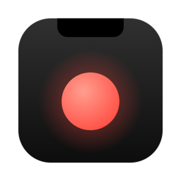
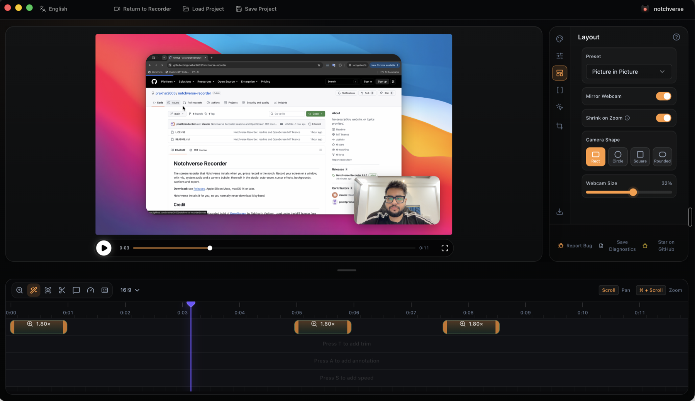
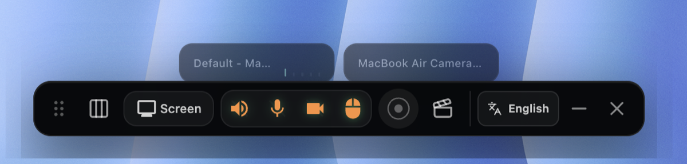
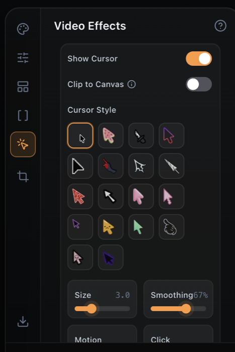
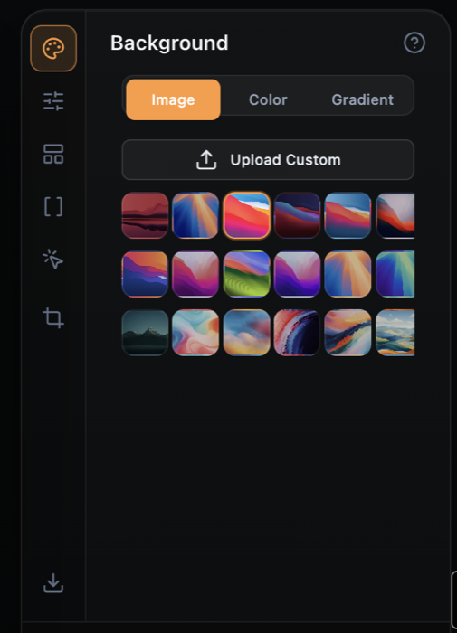

  

<h1 align="center">Notchverse Recorder</h1>

Record your screen, your voice and your face, then make it look good. The screen recorder that comes with Notchverse.

  <a href="../../releases/latest"><b>Download for Mac</b></a> · Apple Silicon · macOS 14 or later · Free

  

## What it does

- **Record anything.** Your whole screen or a single window, even full-screen apps.
- **Voice and sound.** Your mic, your Mac's audio, or both.
- **See yourself.** A round camera bubble floats on top while you record, like Loom. It stays out of the screen capture itself, so you never appear twice.
- **Auto-zoom.** It zooms in where you click, then eases back out. You can adjust every zoom on the timeline.
- **Cursor effects.** Bigger, smoother cursors in 18 styles, with click highlights.
- **Backgrounds.** Wallpapers, colours or gradients behind your recording, with padding and rounded corners.
- **Captions on your Mac.** Subtitles are generated locally. Nothing is uploaded.
- **Export.** MP4 or GIF, in widescreen, vertical or square.

  

  
  &nbsp;&nbsp;
  

## Install

**With Notchverse (easiest):** press the record button in the notch. Notchverse downloads the recorder, installs it into Applications and opens it. There's nothing else to do.

**By hand:** download the `.dmg` from [Releases](../../releases/latest), drag **Notchverse Recorder** into Applications and open it. If macOS says it can't check the app, go to **System Settings → Privacy & Security** and click **Open Anyway** (once).

### Permissions

The first time you record, macOS asks for **Screen Recording**, **Microphone** and **Camera**.

If no Screen Recording pop-up appears:
1. Open **System Settings → Privacy & Security → Screen & System Audio Recording**.
2. Click **+** and add **Notchverse Recorder**.
3. Quit the recorder and open it again. macOS only applies the change after a restart.

A window missing from the list is usually a full-screen app. Pick **Screens** to record it, or take the app out of full screen.

## Credit

Notchverse Recorder is a rebranded build of **[OpenScreen](https://github.com/siddharthvaddem/openscreen)** by Siddharth Vaddem, used under the MIT licence (see [LICENSE](LICENSE)). Thank you, Siddharth.

Changes from OpenScreen:
- Notchverse name, icon and colours.
- A toolbar that always takes clicks.
- A floating camera preview while you record.
- Recorder windows that stay on top of full-screen apps.
